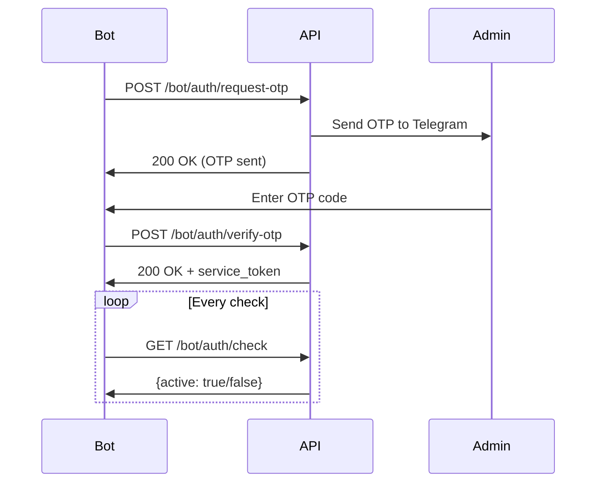

# ?? Telegram Bot Authentication API

Complete guide for authenticating your Telegram bot with OTP and service tokens.

---

## ?? Table of Contents

- [Overview](#overview)
- [Authentication Flow](#authentication-flow)
- [API Endpoints](#api-endpoints)
- [Implementation Examples](#implementation-examples)
- [Token Management](#token-management)
- [Security](#security)
- [Error Handling](#error-handling)
- [Testing](#testing)

---

## ?? Overview

The Bot Authentication system allows your Telegram bot to authenticate once using OTP (One-Time Password) and receive a **service token** that:

? Stays connected permanently (no session validation)  
? Only checks if the admin account is active  
? Returns simple `true`/`false` status  
? Bypasses single-session restrictions  

### Key Concepts

| Concept | Description |
|---------|-------------|
| **Service Token** | Long-lived token with `client_type: "service"` |
| **OTP** | 6-digit code valid for 5 minutes |
| **Admin Status** | Boolean indicating if admin is active |
| **Bot Identifier** | Unique name for your bot instance |

---

## ?? Authentication Flow



### Step-by-Step

1. **Request OTP**: Bot sends username and identifier
2. **Admin Receives OTP**: 6-digit code sent to admin's Telegram
3. **Verify OTP**: Bot submits OTP code
4. **Receive Token**: Server returns service token
5. **Check Status**: Bot periodically checks admin status

---

## ?? API Endpoints

### 1. Request OTP

**Endpoint:** `POST /bot/auth/request-otp`

**Description:** Request OTP code for bot authentication. OTP is sent to admin's Telegram.

**Request Body:**
```json
{
  "username": "admin",
  "bot_identifier": "my_telegram_bot"
}
```

**Parameters:**

| Field | Type | Required | Description |
|-------|------|----------|-------------|
| `username` | string | ? | Admin username |
| `bot_identifier` | string | ? | Unique identifier for your bot |

**Success Response (200):**
```json
{
  "success": true,
  "message": "OTP sent to your Telegram. Please verify to get service token.",
  "expires_in": 300
}
```

**Error Responses:**

| Code | Description |
|------|-------------|
| `404` | Admin not found |
| `403` | Admin account is disabled |

---

### 2. Verify OTP & Get Token

**Endpoint:** `POST /bot/auth/verify-otp`

**Description:** Verify OTP code and receive service token for future requests.

**Request Body:**
```json
{
  "username": "admin",
  "otp_code": "123456",
  "bot_identifier": "my_telegram_bot"
}
```

**Parameters:**

| Field | Type | Required | Description |
|-------|------|----------|-------------|
| `username` | string | ? | Admin username |
| `otp_code` | string | ? | 6-digit OTP code |
| `bot_identifier` | string | ? | Same identifier from step 1 |

**Success Response (200):**
```json
{
  "success": true,
  "message": "Bot authenticated successfully. Use this service token for all future requests.",
  "service_token": "eyJhbGciOiJIUzI1NiIsInR5cCI6IkpXVCJ9.eyJzdWIiOiJhZG1pbiIsInJvbGUiOiJzdXBlcl9hZG1pbiIsImJvdF9pZGVudGlmaWVyIjoibXlfdGVsZWdyYW1fYm90IiwiY2xpZW50X3R5cGUiOiJzZXJ2aWNlIiwiZXhwIjoxNzMwNDAwMDAwfQ.xxxxx",
  "token_type": "bearer",
  "admin_info": {
    "username": "admin",
    "role": "super_admin",
    "is_active": true
  }
}
```

**Error Responses:**

| Code | Description |
|------|-------------|
| `401` | Invalid or expired OTP |
| `403` | Admin account is disabled |
| `404` | Admin not found |

---

### 3. Check Admin Status

**Endpoint:** `GET /bot/auth/check`

**Description:** Check if admin is still active. Use this endpoint periodically.

**Headers:**
```
Authorization: Bearer YOUR_SERVICE_TOKEN
```

**Success Response (200):**
```json
{
  "active": true,
  "admin_username": "admin",
  "message": "Admin is active"
}
```

**OR** (when admin is disabled):
```json
{
  "active": false,
  "admin_username": "admin",
  "message": "Admin is disabled"
}
```

**Error Responses:**

| Code | Description |
|------|-------------|
| `401` | Invalid or expired token |
| `403` | Admin account is disabled |

---

## ?? Implementation Examples

### Python (Requests)

```python
import requests
import json
from pathlib import Path

class BotAuthenticator:
    def __init__(self, base_url, username, bot_name):
        self.base_url = base_url
        self.username = username
        self.bot_name = bot_name
        self.token_file = Path("service_token.json")
        self.service_token = self.load_token()
    
    def load_token(self):
        """Load saved service token"""
        if self.token_file.exists():
            with open(self.token_file, 'r') as f:
                data = json.load(f)
                return data.get('service_token')
        return None
    
    def save_token(self, token):
        """Save service token to file"""
        with open(self.token_file, 'w') as f:
            json.dump({'service_token': token}, f)
        self.service_token = token
    
    def request_otp(self):
        """Step 1: Request OTP"""
        response = requests.post(
            f"{self.base_url}/bot/auth/request-otp",
            json={
                "username": self.username,
                "bot_identifier": self.bot_name
            }
        )
        response.raise_for_status()
        return response.json()
    
    def verify_otp(self, otp_code):
        """Step 2: Verify OTP and get token"""
        response = requests.post(
            f"{self.base_url}/bot/auth/verify-otp",
            json={
                "username": self.username,
                "otp_code": otp_code,
                "bot_identifier": self.bot_name
            }
        )
        response.raise_for_status()
        data = response.json()
        
        if data["success"]:
            self.save_token(data["service_token"])
            return data
        else:
            raise Exception(data.get("message", "Authentication failed"))
    
    def check_status(self):
        """Step 3: Check admin status"""
        if not self.service_token:
            raise Exception("Not authenticated. Please run authentication first.")
        
        response = requests.get(
            f"{self.base_url}/bot/auth/check",
            headers={"Authorization": f"Bearer {self.service_token}"}
        )
        response.raise_for_status()
        data = response.json()
        return data["active"]
    
    def is_authenticated(self):
        """Check if bot has valid token"""
        return self.service_token is not None


# Usage Example
if __name__ == "__main__":
    auth = BotAuthenticator(
        base_url="http://localhost:8765",
        username="admin",
        bot_name="my_telegram_bot"
    )
    
    # First time setup
    if not auth.is_authenticated():
        print("?? Starting authentication...")
        
        # Request OTP
        result = auth.request_otp()
        print(f"? {result['message']}")
        
        # Get OTP from user
        otp_code = input("Enter OTP code from Telegram: ")
        
        # Verify OTP
        result = auth.verify_otp(otp_code)
        print(f"? Authenticated! Token saved.")
    
    # Check status
    is_active = auth.check_status()
    if is_active:
        print("? Admin is active - bot can run")
    else:
        print("? Admin is disabled - bot should stop")
```

---

### Python Telegram Bot Integration

```python
from telegram import Update
from telegram.ext import (
    Application, CommandHandler, MessageHandler, 
    filters, ContextTypes
)
import requests
import json
from pathlib import Path

class TelegramBotAuth:
    def __init__(self, api_url, username):
        self.api_url = api_url
        self.username = username
        self.bot_name = "telegram_bot"
        self.token_file = Path("bot_token.json")
        self.service_token = self.load_token()
    
    def load_token(self):
        if self.token_file.exists():
            with open(self.token_file, 'r') as f:
                return json.load(f).get('service_token')
        return None
    
    def save_token(self, token):
        with open(self.token_file, 'w') as f:
            json.dump({'service_token': token}, f)
        self.service_token = token
    
    def request_otp(self):
        response = requests.post(
            f"{self.api_url}/bot/auth/request-otp",
            json={
                "username": self.username,
                "bot_identifier": self.bot_name
            }
        )
        return response.json()
    
    def verify_otp(self, otp_code):
        response = requests.post(
            f"{self.api_url}/bot/auth/verify-otp",
            json={
                "username": self.username,
                "otp_code": otp_code,
                "bot_identifier": self.bot_name
            }
        )
        data = response.json()
        if data.get("success"):
            self.save_token(data["service_token"])
        return data
    
    def check_admin_active(self):
        if not self.service_token:
            return False
        
        try:
            response = requests.get(
                f"{self.api_url}/bot/auth/check",
                headers={"Authorization": f"Bearer {self.service_token}"}
            )
            return response.json().get("active", False)
        except:
            return False


# Initialize bot auth
bot_auth = TelegramBotAuth(
    api_url="http://localhost:8765",
    username="admin"
)


async def start(update: Update, context: ContextTypes.DEFAULT_TYPE):
    """Start command"""
    await update.message.reply_text(
        "?? Welcome to Bot Authentication Demo!\n\n"
        "Commands:\n"
        "/auth - Authenticate bot\n"
        "/status - Check admin status"
    )


async def auth_command(update: Update, context: ContextTypes.DEFAULT_TYPE):
    """Start authentication process"""
    result = bot_auth.request_otp()
    
    await update.message.reply_text(
        "? OTP sent to admin's Telegram!\n\n"
        "Please enter the 6-digit code:"
    )
    
    context.user_data['waiting_for_otp'] = True


async def status_command(update: Update, context: ContextTypes.DEFAULT_TYPE):
    """Check admin status"""
    if not bot_auth.service_token:
        await update.message.reply_text(
            "? Not authenticated. Please use /auth first."
        )
        return
    
    is_active = bot_auth.check_admin_active()
    
    if is_active:
        await update.message.reply_text("? Admin is active - Bot is running")
    else:
        await update.message.reply_text("? Admin is disabled - Bot stopped")


async def handle_message(update: Update, context: ContextTypes.DEFAULT_TYPE):
    """Handle OTP input"""
    if context.user_data.get('waiting_for_otp'):
        otp_code = update.message.text.strip()
        
        result = bot_auth.verify_otp(otp_code)
        
        if result.get("success"):
            await update.message.reply_text(
                "? Authentication successful!\n"
                "Bot is now connected and ready.\n\n"
                "Use /status to check admin status."
            )
            context.user_data['waiting_for_otp'] = False
        else:
            await update.message.reply_text(
                f"? Authentication failed: {result.get('message', 'Invalid OTP')}\n\n"
                "Please try /auth again."
            )
            context.user_data['waiting_for_otp'] = False


async def check_admin_status_job(context: ContextTypes.DEFAULT_TYPE):
    """Periodic check for admin status"""
    if not bot_auth.service_token:
        return
    
    is_active = bot_auth.check_admin_active()
    
    if not is_active:
        print("? Admin disabled - Stopping bot")
        # Optionally stop the bot
        # context.application.stop()


def main():
    """Main function"""
    # Create application
    app = Application.builder().token("YOUR_TELEGRAM_BOT_TOKEN").build()
    
    # Add handlers
    app.add_handler(CommandHandler("start", start))
    app.add_handler(CommandHandler("auth", auth_command))
    app.add_handler(CommandHandler("status", status_command))
    app.add_handler(MessageHandler(
        filters.TEXT & ~filters.COMMAND, 
        handle_message
    ))
    
    # Add periodic admin status check (every 60 seconds)
    app.job_queue.run_repeating(
        check_admin_status_job, 
        interval=60, 
        first=10
    )
    
    # Run bot
    print("?? Bot started!")
    app.run_polling()


if __name__ == "__main__":
    main()
```

---

### Node.js Example

```javascript
const axios = require('axios');
const fs = require('fs');

class BotAuthenticator {
  constructor(baseUrl, username, botName) {
    this.baseUrl = baseUrl;
    this.username = username;
    this.botName = botName;
    this.tokenFile = 'service_token.json';
    this.serviceToken = this.loadToken();
  }

  loadToken() {
    try {
      const data = fs.readFileSync(this.tokenFile, 'utf8');
      return JSON.parse(data).service_token;
    } catch (error) {
      return null;
    }
  }

  saveToken(token) {
    fs.writeFileSync(
      this.tokenFile,
      JSON.stringify({ service_token: token })
    );
    this.serviceToken = token;
  }

  async requestOTP() {
    const response = await axios.post(
      `${this.baseUrl}/bot/auth/request-otp`,
      {
        username: this.username,
        bot_identifier: this.botName
      }
    );
    return response.data;
  }

  async verifyOTP(otpCode) {
    const response = await axios.post(
      `${this.baseUrl}/bot/auth/verify-otp`,
      {
        username: this.username,
        otp_code: otpCode,
        bot_identifier: this.botName
      }
    );
    
    if (response.data.success) {
      this.saveToken(response.data.service_token);
    }
    
    return response.data;
  }

  async checkStatus() {
    if (!this.serviceToken) {
      throw new Error('Not authenticated');
    }

    const response = await axios.get(
      `${this.baseUrl}/bot/auth/check`,
      {
        headers: {
          Authorization: `Bearer ${this.serviceToken}`
        }
      }
    );
    
    return response.data.active;
  }

  isAuthenticated() {
    return this.serviceToken !== null;
  }
}

// Usage
const auth = new BotAuthenticator(
  'http://localhost:8765',
  'admin',
  'my_bot'
);

// Check status periodically
setInterval(async () => {
  try {
    const isActive = await auth.checkStatus();
    if (isActive) {
      console.log('? Admin is active');
    } else {
      console.log('? Admin is disabled - stopping bot');
      process.exit(0);
    }
  } catch (error) {
    console.error('Error checking status:', error.message);
  }
}, 60000); // Every 60 seconds
```

---

## ?? Token Management

### Token Storage Best Practices

1. **File Storage** (Development):
```python
import json
from pathlib import Path

def save_token(token):
    Path("token.json").write_text(json.dumps({"token": token}))

def load_token():
    try:
        return json.loads(Path("token.json").read_text())["token"]
    except:
        return None
```

2. **Environment Variables** (Production):
```python
import os

SERVICE_TOKEN = os.getenv('BOT_SERVICE_TOKEN')
```

3. **Database Storage** (Multi-Bot):
```python
# Store in your database
db.bots.update_one(
    {"bot_id": "my_bot"},
    {"$set": {"service_token": token}}
)
```

### Token Refresh Strategy

Service tokens **never expire**. They remain valid until the admin is disabled. However, you may still want to implement error handling:

```python
def check_status_with_refresh(auth):
    try:
        return auth.check_status()
    except requests.HTTPError as e:
        if e.response.status_code == 401:
            # Token expired - re-authenticate
            print("Token expired, re-authenticating...")
            result = auth.request_otp()
            otp = input("Enter OTP: ")
            auth.verify_otp(otp)
            return auth.check_status()
        raise
```

---

## ?? Security

### Service Token Properties

The service token is a JWT with the following claims:

```json
{
  "sub": "admin",
  "role": "super_admin",
  "bot_identifier": "my_telegram_bot",
  "client_type": "service"
}
```

**Key Features:**
- `client_type: "service"` ? Bypasses single-session validation
- **No `exp` field** ? Token never expires
- No `session_id` ? Not affected by user logins
- Valid forever until admin is disabled

### Security Considerations

| ?? Risk | ? Mitigation |
|---------|---------------|
| Token theft | Store securely, use HTTPS |
| Token exposure | Don't log tokens, use environment variables |
| Compromised admin | Disable admin to invalidate all tokens |
| OTP interception | 5-minute expiry, single-use |

### Best Practices

1. **Use HTTPS** in production
2. **Store tokens securely** (not in git)
3. **Rotate tokens** regularly
4. **Monitor admin status** frequently
5. **Log authentication attempts**
6. **Use unique bot identifiers**

---

## ?? Error Handling

### Common Errors

#### 404 Not Found
```json
{
  "detail": "Admin not found"
}
```
**Solution:** Verify username is correct

#### 403 Forbidden
```json
{
  "detail": "Admin account is disabled"
}
```
**Solution:** Admin must be re-enabled by super admin

#### 401 Unauthorized
```json
{
  "detail": "OTP has expired"
}
```
**Solution:** Request new OTP

#### 401 Invalid Token
```json
{
  "detail": "Invalid or expired token"
}
```
**Solution:** Re-authenticate with OTP

### Error Handling Example

```python
def safe_check_status(auth):
    try:
        return auth.check_status()
    except requests.HTTPError as e:
        if e.response.status_code == 401:
            print("Token expired or invalid")
            return None
        elif e.response.status_code == 403:
            print("Admin account is disabled")
            return False
        else:
            print(f"Error: {e}")
            return None
    except Exception as e:
        print(f"Network error: {e}")
        return None
```

---

## ?? Testing

### Manual Testing with cURL

```bash
# Step 1: Request OTP
curl -X POST http://localhost:8765/bot/auth/request-otp \
  -H "Content-Type: application/json" \
  -d '{
    "username": "admin",
    "bot_identifier": "test_bot"
  }'

# Response: {"success": true, "message": "OTP sent...", "expires_in": 300}

# Step 2: Verify OTP (check Telegram for code)
curl -X POST http://localhost:8765/bot/auth/verify-otp \
  -H "Content-Type: application/json" \
  -d '{
    "username": "admin",
    "otp_code": "123456",
    "bot_identifier": "test_bot"
  }'

# Response: {"success": true, "service_token": "eyJ...", ...}

# Step 3: Check status (use token from step 2)
curl -X GET http://localhost:8765/bot/auth/check \
  -H "Authorization: Bearer YOUR_TOKEN_HERE"

# Response: {"active": true, "admin_username": "admin", ...}
```

### Automated Testing

```python
import pytest
import requests

BASE_URL = "http://localhost:8765"
USERNAME = "admin"
BOT_NAME = "pytest_bot"

def test_request_otp():
    response = requests.post(
        f"{BASE_URL}/bot/auth/request-otp",
        json={"username": USERNAME, "bot_identifier": BOT_NAME}
    )
    assert response.status_code == 200
    data = response.json()
    assert data["success"] == True
    assert data["expires_in"] == 300

def test_verify_invalid_otp():
    response = requests.post(
        f"{BASE_URL}/bot/auth/verify-otp",
        json={
            "username": USERNAME,
            "otp_code": "000000",
            "bot_identifier": BOT_NAME
        }
    )
    assert response.status_code == 401

def test_check_without_token():
    response = requests.get(f"{BASE_URL}/bot/auth/check")
    assert response.status_code in [401, 403]
```

---

## ?? Summary

| Feature | Value |
|---------|-------|
| **Authentication Method** | OTP (One-Time Password) |
| **OTP Validity** | 5 minutes |
| **Token Type** | JWT with `client_type: "service"` |
| **Token Expiry** | Never expires |
| **Session Check** | No (stays connected) |
| **Status Check** | Returns `true`/`false` |
| **Use Case** | Bots, background services |

### Quick Reference

```bash
# Endpoints
POST /bot/auth/request-otp      # Get OTP
POST /bot/auth/verify-otp       # Get token
GET  /bot/auth/check            # Check status

# Token Format
Authorization: Bearer YOUR_SERVICE_TOKEN

# Response
{"active": true|false, "admin_username": "admin"}
```

---

## ?? Support

For issues or questions:

1. Check the [error handling](#error-handling) section
2. Review [security best practices](#security)
3. Test with cURL to isolate issues
4. Check server logs for detailed errors

---

**Status:** ? Production Ready  
**Version:** 2.0.0  
**Last Updated:** 2025-10-31
